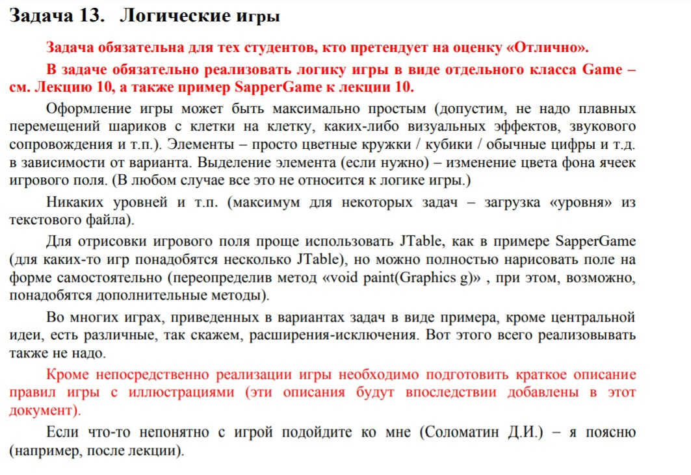
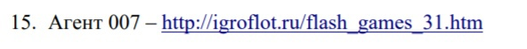

# Task13_15

P.S. 
Автор от слова "совсем" не дизайнер. Хотел разнообразить внешний вид нечасто встречающимися символами из компьютера
В коде присутствует много копипасты, особенно в конструкторах класса Game и перерисовки основной таблицы в Gui
Игра написана полностью сама, единственное (в коде указал) использовал рандомайзер Соломатина Д.И. в методе Game.initializeField()
